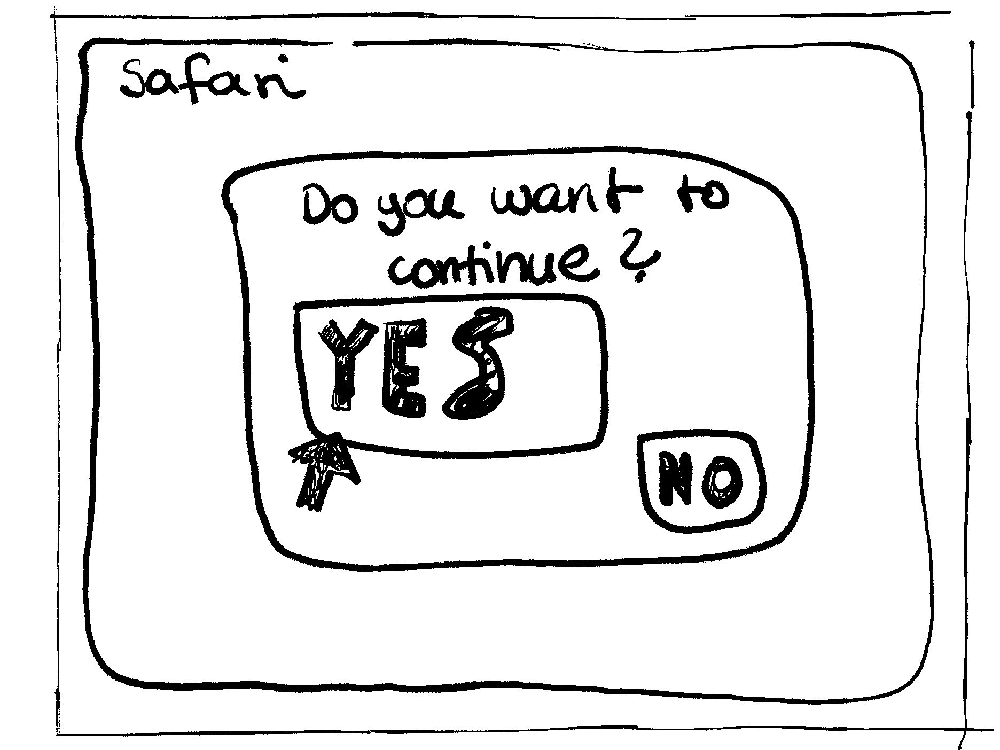

# CubeIT
CubeIT is an AEC-DeepSpace-Game which teaches young children how to deal safely with the digitized internet world by playing through an exciting hacker-attack and killing the virus.

# Team
Christian Ekhator ,Julian Kapl, Julia Meyr, Amina Gabeljic

## 1. Ausgangslage

### 1.1. Ist-Situation
Da Kinder tendenziell schon mit frühen Alter die Internetnutzung kennenlernen, haben sie doch noch wenig Anhung, was im Hintergrund passiert.
Das derzeitige Projekt vom AS Elektroniker Center in Linz NewHorizon erklärt Kindern, wie Daten verteilt werden. Doch hierbei können Gefahren entstehen, die den Kindern bis jetzt noch nicht bewusst sind.
### 1.2. Verbesserungspotenziale

#### Probleme
- Die Kinder haben meist kein Wissen über die Gefahren
- Veraltete Technik

#### Verbesserungen
- Eine bessere Übersicht über die Gefahren im Internet
- Die Kooperation erhalten lassen
- Ein weiterer Lerneffekt für Kinder

## 2. Zielsetzung
Unser Ziel ist es den Kindern beizubringen, dass es Gefahren beziehungsweise Fallen im Internet gibt. CubeIT soll hierebi einen Lerneffekt auslösen, der den Kindern zeigt wie sie reagieren sollen und was passiert, wenn sie es nicht machen.

### Soll-Zustand

### Start des Games
Der Start beginnt damit, das der Bildschirm auf der Wand eine Vorschau produziert, von einem I-Pad, wobei 3 Apps auf dem I-Pad angezeigt werden. Es sollte bei nur 3 Apps bleiben, um die Kinder anfangs nicht mit zu vielen App-Anzeigen zu überfordern.

Übersicht über die 3 Apps:
1. App: Safari
2. App: Folder
3. App: Settings

### Safari: 3 Spiele
Safari wird automatisch geöffnet, und dann gibt es die Möglichkeit drei verschiedene Spiele zu spielen. Somit soll die Spannung am Anfang erstmal ein wenig gelockert werden.

Wie wählen die Kinder ein Spiel aus?
Auf dem Boden erscheinen drei Felder, welche für die Auswahl des jeweiligen gewünschten Spiels ist. Die Felder am Boden sollen gleich groß wie die "Spielfelder" am Bildschirm sein. In welchem Feld mehr Benutzer drinnen stehen, dieses Spiel wird ausgewählt. 

Übersicht über die 3 verschiedenen Spiele:
1. Spiel: Rock-Scissor-Paper
2. Spiel: Tic-Tac-Toe
3. Spiel: Memory

### Öffnen einer App
In diesem Beispiel öffnen wir das Spiel Tic-Tac-Toe und die Kinder können das jeweilige Spiel bis zum Ende spielen.

### Frage zum Weiterspielen
Nach dem Ende des Spiels kommt ein Feld über das Game, wo die Frage kommt: "Do you want to continue?". Hierbei werden am Boden zwei Felder erscheinen, wobei die Felder genauso groß wie die Buttons am Bildschirm sind, um "Yes" oder "No" auszuwählen.
Hierbei wählen die Kinder wieder durch das draufsteigen auf eines der jeweiligen Felder aus, ob sie "Yes" oder "No" auswählen möchten.
Was die Kinder allerdings nicht wissen ist, dass egal ob "Yes" oder "No" ausgewählt wird, beim Klicken jedes Buttons wird auf jeden Fall der Hacker-Angriff gestertet - Somit ist es quasi egal, ob die Kinder auf "Yes" oder "No" klicken.

### Pop-Up-Angriff
Plötzlich tauchen lauter flackernde Pop-Ups auf, wobei die Kinder direkt merken, dass etwas nicht stimmt. Auf den Pop-Ups sollen verschiedene random-Memes angezeigt werden.

### Boom
Nachdem also zahlreiche random-Memes auf dem Bildschrim aufgetaucht, und wieder verschwunden sind, wird der komplette DeepSpace schlussendlich schwarz und gleichzeitig hört man ein "Boom" - Dies soll sozusagen den "ShutDown" des DeepSpaces symbolisieren bzw. die komplette Machtübernahme des Hackers darstellen.

### You've Been Hacked
Im nächsten Moment wird der komplette DeepSpace rot sein, und gleichzeitig soll alles piepen.
Vorne auf dem Bildschirm wird die Message "You've been Hacked!" angezeigt (+ Totenkopf).

### Game On The Floor
Dann poppen am Boden lauter rote "Cubes" mit Totenköpfen auf. Links vom DeepSpace gibt es am Boden 3 große Kisten am Boden symbolisiert.
Wenn nun ein Kind/Person den DeepSpace-Boden betritt, so scheint unter den Füßen eine Kiste auf. Jede Kiste soll darüber einen kleinen Counter haben, der bis 5 geht. (Anzeige: 0/5, 1/5, etc.)
Nun kann jede Person, die automatisch eine Kiste mit der Kapazität von 5 besitzt, die roten Hacker-Cubes aufsammeln. Wenn die eigene Kiste voll ist, so rennt die Person zu einer der 3 großen Kisten am linken Rand und stellt sich auf eine der 3 Kisten drauf. Wenn man sich auf eine der 3 Kisten draufstellt, so wird die eigene Kiste entleert, und die Kapazität ist nun wieder bei 0/5. Also könnnen wir nun wieder weitere rote Hacker-Cubes einsammeln gehen!

### Hacked Again - Game On The Wall
Wenn alle roten Hacker-Cubes vom Boden entfernt wurden, so wird der Boden wieder schwarz und die Kisten sind dann auch wieder weg. 
Nun greift der Hacker allerdings nochmal an, und infiziert die Wand vom DeepSpace. Somit poppen nun an der Wand, bis zu einer Höhe von 1,70 - 1,75 m wieder laute rote Hacker-Cubes auf. Diese müssen allerdings nun durch "Touch" entfernt werden. Sprich, wenn man einen roten Hacker-Cube berührt, so verschwindet er wieder - So bereinigt man dann wieder die Wand von den Hacker-Viren. 

### Succes - DeepSpace bereinigt
Es wurden also sowohl der Boden, als auch die Wand von den Hacker-Viren befreit! Jetzt wird der gesamte Raum blau, und vorne am Bildschirm wird groß "SUCCES" angezeigt. Die Kinder haben es also geschafft den DeepSpace wieder virenfrei zu machen. Dazu soll noch ein bestimmter "Success-Sound" auftönen.

## 3. Risikoanalyse

#### Chancen
 
- Zukunftorierntiertes Umgehen mit dem Internet / den sozialen Medien wird den Kindern spielerisch gelehrt
- Kooperation mit dem AEC bleibt erhalten
- Projekt bleibt im AEC DeepSpace erhalten

#### Projektrisiken

- Komplikationen bei der komplexen und neuen Umgebung (Unity, etc.)
- Fehlerhafte Einschätzung bzgl. Zeitaufwand (Zeiteinteilung)
- Komplikationen bei der Zusammenarbeit mit dem AEC/Deepspace

## 4. Projektablauf

#### 4.1 Rahmenbedingungen

- **Personell**
    - Klare Rollenverteilung
    - Clean Code
    - Demokratie
        - Entscheidungen untereinander abstimmen
        - Gegenseitige Unterstützung
    - Alles wird gründlich mitdokumentiert
        - Git Commits
        - Versionen
        - Fehlerbehebungen

- **Finanziell**
    - Tools die wir verwenden, sollten uns kostenlos zur Verfügung stehen
    - eventuell: finanzielle Unterstützung / private Einlagen

#### 4.2 Programmierumgebung

- **Umgebung**
    - GitHub
    - Unity
    - Visual Studio 2022

#### 4.3 Meilensteine für die Projektumsetzung

- **Wintersemester**
    - Genehmigung des Projektantrags
    - Aufgabenverteilung (Wer macht was?)
        - Jeder bekommt einen bestimmten Bereich zugewiesen
    - Kennenlernen / Einlesen in Horizon
    - "First-Guide-In" in die App
    - Website Gestaltung (Wireframe)
        - Demo mit Testdaten
    - Datenbank Erstellen und die Testdaten einlesen

- **Sommersemester**
    - Webserver
    - Schnittstellen zwischen den Komponenten