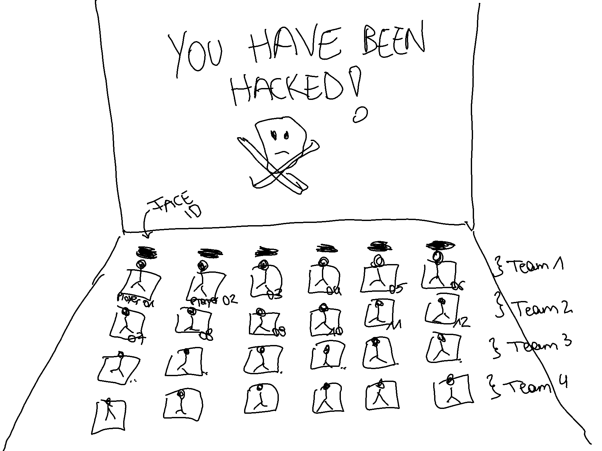
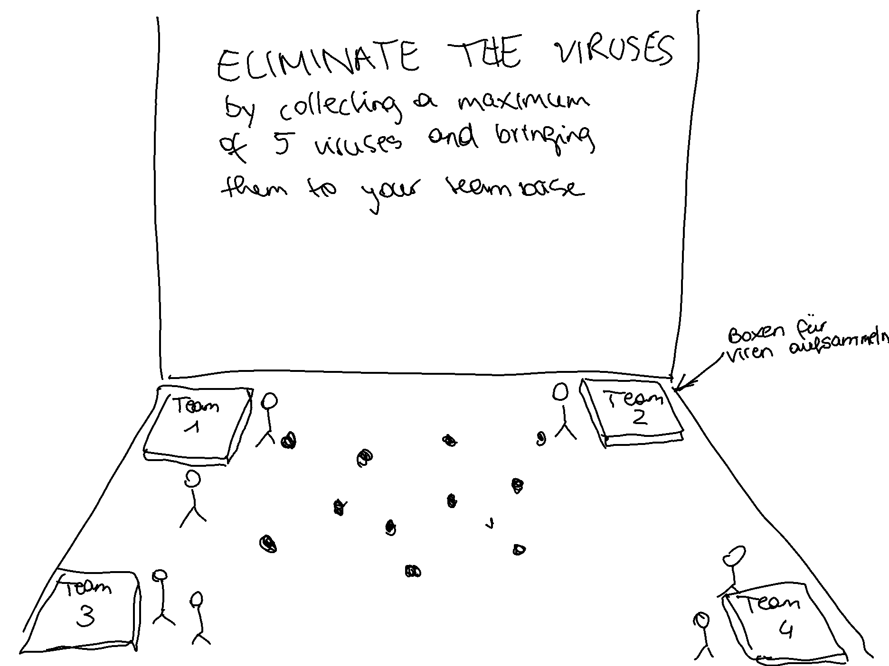
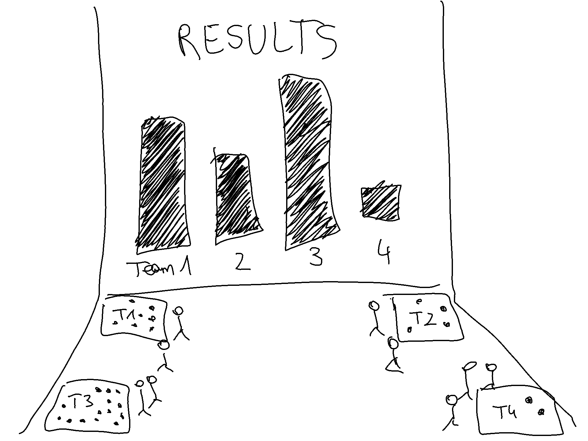
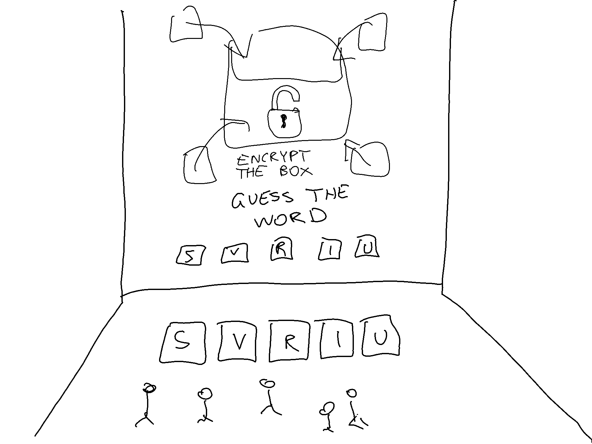

# HackTrap
HackTrap is an AEC-DeepSpace-Game which teaches young children how to deal safely with the digitized internet world by playing through an exciting hacker-attack and killing the virus.

# Userstories
- Die User sollen am Boden getracket werden.
- Die User sollen in der Lage sein ein Ipad über Usertracking am Boden zu nutzen.
  - Sie sollen zwischen Minispiele entscheiden können (eines auswählen können).

- Die User sollen das ausgewählte Minispiel spielen können (via Usertracking).
  - Es soll auswählbar sein welches Feld sie besetzen wollen.
- Die User sollen bei der "Hackerfrage" eine der Buttons (via Usertracking) auswählen können.

# Sprints
### 1. Sprint - Project Initialisation
- Projektantrag
- Feedback von Prof. Hasi - Userstories überarbeiten (nach AEC Meeting)
- Horizon Template zum Laufen bringen (in Code einarbeiten)
- Unity herunterladen (AEC Developer Kid)
- Vorbereitung AEC Meeting (20.10)

### 2. Sprint - Ipad & Minigames
- Unity Tutorials
- 3D Projekt aufsetzen (AEC Standards)
- Ipad und Minispiele anzeigen
- 1 Minispiel implementieren (TicTacToe)
- Auswahl am Boden (Minispielauswahl, TicTacToe, Usertracking)
- Hackerfrage + Minispiel Computer Intelligence

## Our Team
Christian Ekhator, Julian Kapl, Julia Meyr & Amina Gabeljic

## 1. Initial Situation
### 1.1. Current Situation
Since children tend to learn about Internet use at an early age, they still have little idea of what is happening in the background.
The current project from the ARS Elektroniker Center in Linz, NewHorizon, explains to children how data is distributed. However, dangers can arise that children are not yet aware of.

### 1.2. Potential for improvement
#### Problems
- The children usually have no knowledge about the dangers that the internet comes with
- Outdated technology / game

#### Improvements
- A better overview of the dangers on the Internet
- Let the cooperation be maintained
- Another learning effect for children to use in every day life 

## 2. Goal
Our goal is to teach children that there are dangers and traps on the Internet. CubeIT should trigger a learning effect that shows the children how they should react and what happens if they (unintentionally) do something wrong.

## Target state

### Start of the game
The game begins with the screen on the wall producing a preview of an iPad, with 3 apps being displayed on the iPad. It should stay with only 3 apps, so as not to overwhelm the children with too many app displays at the beginning.

Overview of the 3 apps:
1st App: Safari
2nd App: Folder
3rd app: Settings

### Safari: 3 games
Safari opens automatically, and then you have the option to play three different games. This is to ease the tension at the beginning.

How do the children choose a game?
Three fields appear on the floor, which is for the selection of the desired game. The fields on the floor should be the same size as the "game fields" on the screen. Whichever field has more users inside, that game is selected. 

Overview of the 3 different games:
1st game: Rock-Scissor-Paper
2nd game: Tic-Tac-Toe
3rd game: Memory

### Opening an app
In this example, we open the game Tic-Tac-Toe and the children can play one round of the respective game to the end.

### Question to continue playing
After the end of the game, a box will appear above the game where the question will come: "Do you want to continue?". Here, two squares will appear on the floor, with the squares being the same size as the buttons on the screen to select "Yes" or "No".
Here again, the children choose whether they want to select "Yes" or "No" by climbing on one of the respective fields.
What the children don't know, however, is that no matter whether "Yes" or "No" is selected, when each button is clicked, the hacker attack will be sent in any case - so it doesn't really matter whether the children click on "Yes" or "No".

### Pop-up attack
Suddenly, loud flickering pop-ups appear, and the children immediately notice that something is wrong. Various random memes are to be displayed on the pop-ups.

### Boom
After numerous random memes appeared and disappeared on the screen, the entire DeepSpace finally goes black, and at the same time, you hear a 'Boom.' This is meant to symbolize the 'shutdown' of DeepSpace or represent the complete takeover by the hacker.

### You've Been Hacked
In the next moment, the entire DeepSpace will turn red, and at the same time, everything will beep. On the front of the screen, the message 'You've been Hacked!' will be displayed (+ skull).

### Inizialising each Player
Timer: 1 Minute 

Before the game starts, for each player will appear a block with footsteps on the floor. Everyone should find a block and step inside one. As soon as all blocks are stepped on, each player will be inizialised and therefore scaned via face id.
For the game, each player will be included in one of the four teams. Each row forms a team.

### Game On The Floor 
Timer: 3 Minutes
Viruses: 300 (for 20 people, each person we say collects 5 viruses 3 times)

Then red "viruses" with skulls pop up mainly on the floor. Some viruses might appear in the air, if a player then stands under one, the virus will be "destroyed", drop on the floor and will automatically be collected by the player. In each corner of the DeepSpace a container with a different color for each team appears.
Each player has now a crate in their teamcolor under their feet to collect a maximum of 5 red viruses by standing on them before dumping them into their team container by standing on top of it. Each crate should have a small counter that goes up to 5 to show the player when he has to dump the viruses into his team container (Display: 0/5, 1/5, etc.). 
By dumping the collected viruses the own player's crate clears itself, the capacity is now back to 0/5 and you can collect even more viruses. 
If the player's crate is full (5/5) and he runs into another virus, all collected viruses of his create will be set free again.
 

#### Evaluation
As soon as all viruses are collected or the timer stopps, a graph shows which team "cleared" the most viruses by collecting them and putting them into their team container.
 

#### Animation & Encrypting Viruses
Now we can see every container (from each team). Those will be put together into a bigger container which the people now have to encrypt.
For this a random anagram will be generated, displayed on the screen and the people have to order the letters in order to generate a password and encrypt the container with the viruses inside. The difficulty here is to find the correct word from the anagram.
If the word was found, the container is now "hackerproof".

### Succes - DeepSpace is virusfree
So the DeepSpace has been freed from the hacker viruses! Now the entire room turns blue, and "SUCCES" is displayed in large letters on the front of the screen. In addition, a certain "success sound" is to sound and a group photo (made when scanning each player via face id) will be displayed to all of the people.

## 3. Risk Analysis
### Opportunities

- Teaching children a future-oriented approach to the internet and social media in a playful manner.
- Maintaining cooperation with the AEC.
- The project remains within the AEC DeepSpace - support for both HTL Leonding and AEC due to the cooperation.

### Project Risks

- Complications in the complex and new environment (Unity, etc.).
- Incorrect estimation of time requirements (time management).
- Complications in collaboration with the AEC/DeepSpace.

## 4. Project Workflow

### 4.1 Framework

#### Personnel

- Clear role distribution.
- Clean code.
- Democracy.
  - Consensus on decisions among team members.
  - Mutual support.
- Thorough documentation.
  - Git commits.
  - Versions.
  - Bug fixes.

#### Financial

- The tools we use should be freely available to us.
- Possibly: financial support/private contributions.

### 4.2 Development Environment

#### Environment

- GitHub.
- Unity.
- Visual Studio 2022.

### 4.3 Project Implementation Milestones

#### Winter Semester

- Approval of the project proposal.
- Task allocation (who does what?).
- Familiarization with Horizon.
- "First-Guide-In" into the app.
- Website design (wireframe).
  - Demo with test data.
- Creating the database and importing test data.

#### Summer Semester

- Web server.
- Interfaces between the components.
