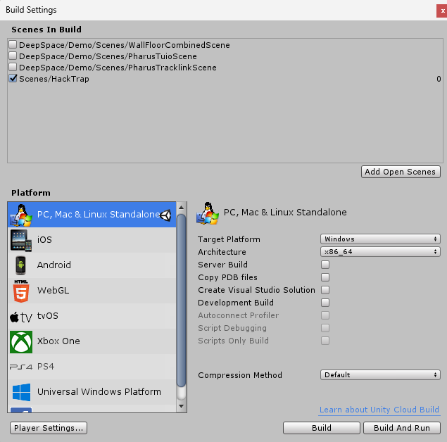

# Dokumentation Deepspace

Die Grundsätze des Deepspaces bzw. Unity werden in dem PDF :page_facing_up: [deepspace-dev](./deepspace_dev.pdf) erklärt.

Weiters werden in den nächsten Absätzen nun genauer die von uns implementierten Einzelheiten erläutert:

## StateManager

Grundsätzlich werden in Unity `Scenes` verwendet, da der Deepspace jedoch nur mit einer Scene arbeitet, müssen alle Scenes in `Prefabs` verwandelt und in die Hauptscene `Hacktrap` eingefügt werden.

### Scene Template (für die einzelnen Prefabs)

TODO

Der `StateManager` hilft dann dabei von einer Scene bzw. einem Prefab zum nächsten überzugehen.

Der `StateManager` sieht wie folgt aus:

## PlayerTracker

## Pharus

## Verbindung zwischen Wall und Floor

## Main-Game (Viren-Einfangen-Spiel)

## Encrypt-Game (Anagramm-Lösen-Spiel)

## Build für Deepspace verschicken

Um einen Build zu verschicken, muss man zunächst in Unity in der Taskleiste auf `File > Build Settings` gehen und dann die jeweilige Hauptscene auswählen (in unserem Fall `Hacktrap`).

Danach muss man nur noch auf `Build` drücken und den Build in einen Ordner speichern.
